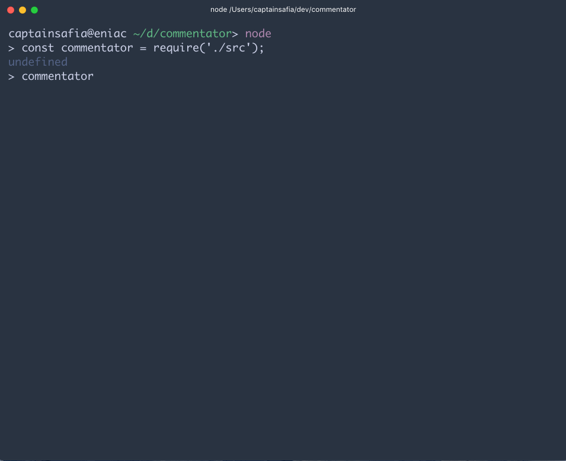

# commentator
commentator is an npm package for generating block and inline comments for a
given programming language. It can be used to create comments that are appended
to the top of files, like license headers.

### Installation

```
$ npm install --save @captainsafia/commentator
```

### Running Unit Tests
```
$ git clone https://github.com/captainsafia/commentator.git
$ cd commentator
$ npm t
```

### Usage


